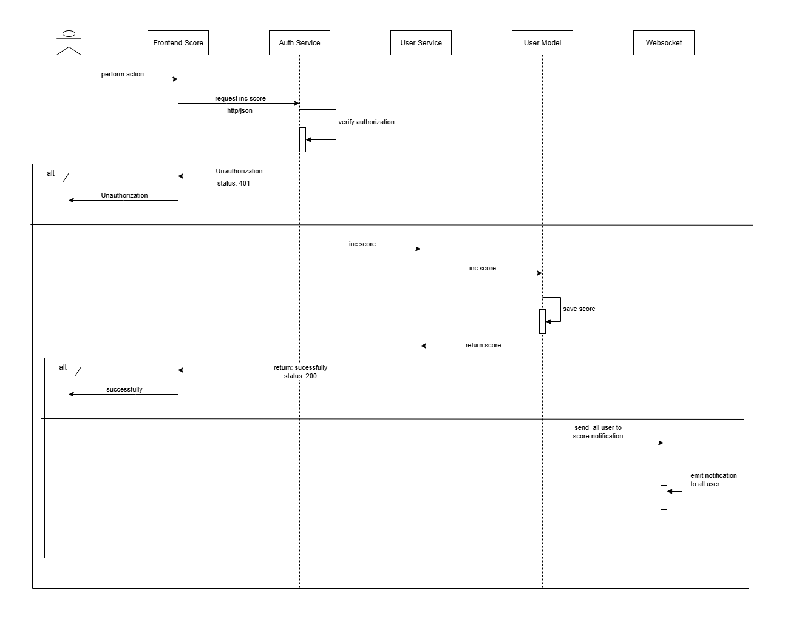
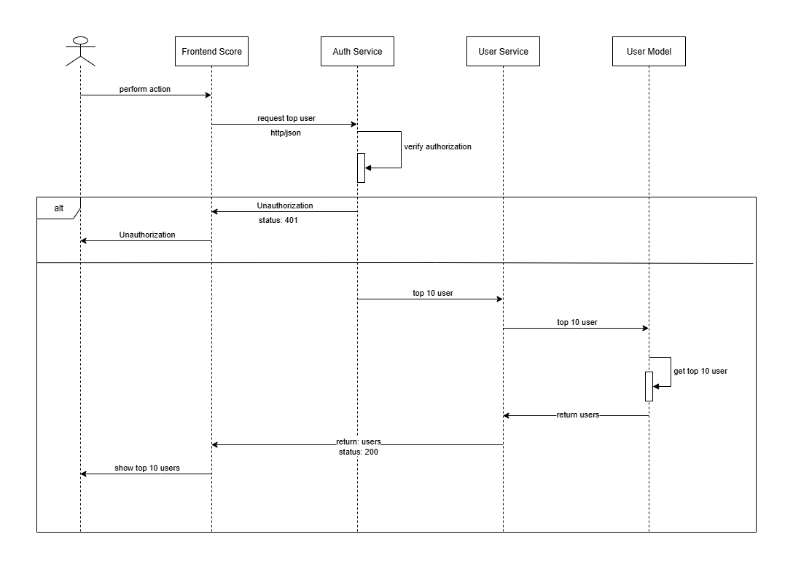

# PROBLEM 4
``` bash
git clone https://github.com/thanhcong200/challenge_99tech.git
cd challenge_99tech 
node ./src/propblem4.ts
```

# PROBLEM 5
# CRUD App with Express + TypeORM + PostgreSQL

A simple CRUD API for products built with **Node.js**, **Express**, **TypeORM**, and **PostgreSQL**.  
Supports pagination, filtering, and soft delete. Fully dockerized for easy setup.

---

## 🚀 Features
- Create, Read, Update, Delete products
- Pagination & keyword search
- Price range filtering
- Soft delete (`is_delete`)
- Centralized error handling with JSON response
- Run with Docker or locally

---

## 📦 Requirements
- [Node.js](https://nodejs.org/) v18+
- [Docker](https://www.docker.com/)
- [Docker Compose](https://docs.docker.com/compose/)

---

## ⚙️ Installation

### 1. Install docker
- [Docker](https://www.docker.com/)
- [Docker Compose](https://docs.docker.com/compose/)

### 2. Clone repository
```bash
git clone https://github.com/thanhcong200/challenge_99tech.git
cd challenge_99tech 
```
COPY .env.example .env

### 3. Build & Run project
``` bash
docker-compose --env-file .env up -d
```

## Test Application

- POST http://localhost:8080/api/products → create a product with body: name: string, price: number

- GET http://localhost:8080/api/products → list products (with pagination & filters: keyword, page, limit, minPrice, maxPrice)

- GET http://localhost:8080/api/products/:id → get product by ID

- PATCH http://localhost:8080/api/products/:id → update product

- DELETE http://localhost:8080/api/products/:id → soft delete product


# PROBLEM 6

# Scoreboard API Module Specification

## Overview
This module provides an API service to manage and display a **live scoreboard** for users.  
It supports:
- Tracking user scores
- Updating scores when a user performs an action
- Displaying the **Top 10 users**
- Preventing unauthorized score manipulation
- Real-time scoreboard updates

---

## Features
1. **Scoreboard API** – Exposes REST endpoints to fetch top scores.
2. **Score Update API** – Allows users to increment their score upon completing an action.
3. **Authentication & Security** – Ensures only valid users can update scores.
4. **Real-time Updates** – Uses WebSocket

## Sequence diagram

## Flow Diagram




## Security Considerations

- Require JWT for score updates.

- Validate all requests to prevent malicious users from forging score increments.

- Implement rate limiting to prevent spamming score updates.

- Keep audit logs for score changes.


## Possible Improvements

- Add leaderboard caching (Redis) for fast read of Top 10 scores.
- Increase score in redis method ZADD leaderboard INCR 50 user:1, ZADD leaderboard INCR 50 user:2, ZADD leaderboard INCR 50 user:3, ....
- Get top 10 user score ZREVRANGE leaderboard 0 2 WITHSCORES
- Create Job in application and update user score to database
